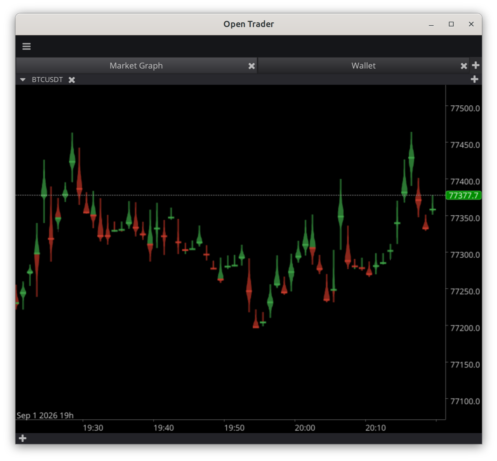

# Open Trader

Looking for angels! [Online Pitch-Deck](https://xscratcher.space/investor/) if you are interested in investing Open Trader

## What is it

The next-generation open-source exchange trading platform with highly modular and flexible cross-platform UX and connections to every crypto-exchange.

The AI Assistant provides users with modern AI power for tasks not limited to trading, with the ambition to become your open-source AI co-pilot helping with everyday tasks anywhere.

Universal trading API to run a third-party or implement and run your own automated trading strategy

## Features

### Secure

Standalone application. API keys are read locally and used only to sign requests to the exchange. No accounts, no cloud, no third-party custody.

### Connector for every exchange

Connectors are built on DataHub, a generic data pipeline. A connector is entity definitions plus endpoint mapping — nothing else. Any exchange with a public API is a target; a connector that does not exist yet is a 10-min. task for the AI assistant.

### Trading H.U.D.

Heads-up display as the UI principle: every value needed for a decision is on screen at once, no drill-down, maximum information density. Panels — charts, order book, orders, trades, wallet — combine in any layout with tabs and splitters to any depth.

Vector rendering with incremental redraws keeps the display smooth at live-stream rates. The renderer (ThorVG) is WebAssembly-compatible; a browser build is on the roadmap.

### Buoy candle notation

A new HLMV (high-low-mean-volume) chart notation. Each period is a buoy: body area is traded volume, the waist sits at the volume-weighted average price, the tips are the period high and low. Volume, range and where the volume actually traded — one shape, one glance. Classic Japanese candlesticks are available as well.

### AI assistant

Your AI-copilot with the unique in-depth AI-context management and sub-agent orchestration: Builds strategies, guides exchange on-boarding, supervises execution.

### Trading API and bot sandbox

One unified trading API: C++, Python bindings, MCP server. Run third-party strategies or your own. Test them in an isolated sandbox on historical data before real money.

### Scalability

Open Trader is not just single terminal application, it is a platform. Scale and configure it according to your needs, run as headless service and control remotely or create market data caching server to get historical data faster. Deploy and use any local LLM for all the AI tasks or just to sub-agent orchestration, connect most powerful external AI-models for mission critical tasks

## Contributing

- Read [CONTRIBUTING.md](CONTRIBUTING.md)

## License

Open Trader project is currently developed under the Intellectual Property Reserve License and is planned to move to GPLv3 once the project launches

- Read [LICENSE.md](LICENSE.md) 
